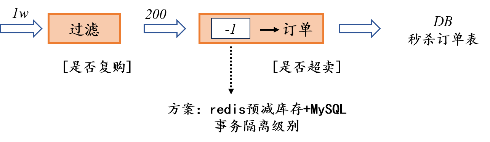

### 事务隔离级别

项目实际方案设计视图如下：

<figure>
	<a href="../assets/img/picture/redis.png"></a>
</figure>

#### 1.方案介绍
事务隔离级别是数据库事务处理的基础，用于定义事务之间可能的相互影响程度。
在并发环境下，不同的事务可能会同时访问相同的数据库资源，隔离级别就是为了解决由此产生的问题，如脏读、不可重复读、幻读等。

SQL标准定义了四种事务隔离级别，从低到高依次为：
1. READ UNCOMMITTED（读未提交）：
    - 最低的隔离级别，允许事务读取未被其他事务提交的变更（脏读）。
    - 允许读取到尚未提交的数据，这可能导致数据的不一致。
2. READ COMMITTED（读已提交）：
    - 保证一个事务修改的数据提交后才能被另外一个事务读取。
    - 避免了脏读，但可能发生不可重复读和幻读。
3. REPEATABLE READ（可重复读）：
    - 确保在同一个事务中多次读取同样记录的结果是一致的。
    - 避免了脏读和不可重复读，但可能发生幻读（MySQL的默认隔离级别）。
4. SERIALIZABLE（可串行化）：
    - 最高的隔离级别，通过强制事务串行执行，避免脏读、不可重复读和幻读。
    - 虽然可以避免并发问题，但性能开销最大。

#### 2.实现细节

在MySQL中，默认的事务隔离级别是REPEATABLE-READ（可重复读）。
在这个隔离级别下，当执行一个UPDATE语句时，MySQL会采用一系列的措施来确保事务的隔离性和一致性，其中就包括在事务中对要更新的行进行锁定。

##### @Transactional

`@Transactional` 是Spring框架提供的一个注解，用于声明一个方法或类需要事务支持。
当使用`@Transactional`注解时，Spring会使用AOP（面向切面编程）技术，在运行时为被注解的方法或类动态地添加事务管理功能。

##### 使用场景

  - 服务层方法：通常将`@Transactional`注解加在业务逻辑层（Service层）的方法上，确保这些业务操作具有事务性。
  - 异常处理：默认情况下，`@Transactional`注解的方法在遇到运行时异常（RuntimeException）和错误（Error）时会回滚事务，而遇到检查型异常（checked exceptions）则不会。可以通过`@Transactional`的`rollbackFor`和`noRollbackFor`属性来定制这一行为。

#### 3.代码示例

在数据库操作中，特别是在使用关系型数据库如MySQL时，执行`UPDATE`语句时锁定行的行为是由数据库管理系统（DBMS）自动处理的，而不是直接通过代码显式控制的。因此，无法直接在Java代码或Spring框架的`@Transactional`注解中指定“锁定行”的代码，因为这是数据库层面的行为。

以下代码展示在Spring框架中执行`UPDATE`语句的代码，并解释在这个操作发生时，MySQL（在`REPEATABLE-READ`隔离级别下）会如何锁定行。
```
@Transactional  
@Override  
public boolean seckillGoods(User user, Long goodsId) {  
    // 假设这是SeckillGoodsService中的一个方法  
    // 使用MyBatis-Plus的UpdateWrapper来构建更新条件  
    boolean updateSuccess = seckillGoodsMapper.update(  
        new UpdateWrapper<SeckillGoods>()  
            .setSql("stock_count = stock_count - 1")  
            .eq("goods_id", goodsId)  
            .gt("stock_count", 0) // 确保库存大于0时才进行更新  
    ) > 0; // 判断是否成功更新了记录（即受影响的行数是否大于0）  
  
    // 如果updateSuccess为true，则表示库存成功减少，秒杀成功  
    // 如果为false，则表示库存不足或未找到对应商品，秒杀失败  
  
    return updateSuccess;  
}
```
在上述代码中，`seckillGoodsMapper.update(...)`方法执行了一个`UPDATE`操作，这个操作会尝试将指定`goods_id的SeckillGoods`记录的`stock_count`字段值减1。
但是，请注意，这里的代码本身并不包含任何直接控制行锁定的逻辑。

当这个`UPDATE`语句在MySQL数据库中执行时，如果数据库的隔离级别设置为`REPEATABLE-READ`（MySQL的默认隔离级别），那么MySQL会自动对满足条件的行进行锁定，以防止其他事务同时修改这些行。
这种锁定是隐式的，不需要在Java代码中显式指定。

因此，当调用`seckillGoods`方法时，MySQL会在执行`UPDATE`语句时自动处理行锁定，以确保事务的隔离性和一致性。如果其他事务尝试修改同一行，它们将被阻塞，直到当前事务提交或回滚并释放锁。

#### 4.补充知识

1. 锁机制：
    - 数据库通过锁机制来实现事务的隔离性。锁可以分为共享锁（Shared Lock）和排他锁（Exclusive Lock）。共享锁允许多个事务同时读取一个数据项，而排他锁则确保了一个事务在读取或写入数据项时，其他事务不能对该数据项进行读写操作。
    - 不同的隔离级别对应着不同的锁策略和粒度，从而影响事务的并发性能和隔离性。
2. 多版本并发控制（MVCC）：
    - MVCC是一种避免读写冲突，提高并发性能的技术。它允许数据库在读取数据时不必加锁，而是通过维护数据的多个版本来实现。MVCC在可重复读和读已提交隔离级别下广泛应用，特别是在像MySQL的InnoDB这样的存储引擎中。
3. 事务的ACID特性：
    - 原子性（Atomicity）：事务作为一个整体被执行，要么全部完成，要么全部不执行。
    - 一致性（Consistency）：事务必须使数据库从一个一致性状态变换到另一个一致性状态。
    - 隔离性（Isolation）：并发执行的事务之间不会互相干扰，每个事务都独立执行。
    - 持久性（Durability）：一旦事务提交，它对数据库的修改就是永久性的，即使系统发生故障也不会丢失。

<h4 align = "right">xubin.</h4>


