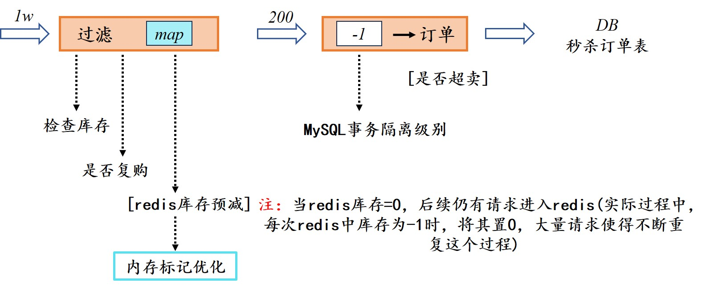

### 内存标记优化

在秒杀系统中，库存的快速减少和并发控制是两大挑战。虽然Redis提供了原子性的库存减少操作（如`DECR`），
但在高并发场景下，大量的请求仍然可能同时到达服务器，导致Redis成为瓶颈或需要处理大量的无效请求（即库存已经为0时仍尝试减少库存）。

内存标记优化是一种策略，用于在本地内存中快速判断某个商品是否还有库存，从而减少对Redis的访问压力，并提前拦截无效的秒杀请求。这种优化可以减少对Redis的无效请求，提高系统的整体响应速度和吞吐量。

项目实际方案设计视图如下：

<figure>
	<a href="../assets/img/picture/map.jpg"></a>
</figure>

#### 1.方案介绍

内存标记优化的核心思想是在本地内存中维护一个标记集合（如`HashMap`），用于记录哪些商品的库存已经为0。
当秒杀请求到达时，首先检查这个内存标记集合，如果标记显示该商品库存为0，则直接返回库存不足的错误，无需再向Redis发送请求。如果内存标记显示库存充足或未标记，则继续执行Redis库存预减操作。

#### 2.实现细节

- 内存标记集合：通常使用`ConcurrentHashMap`或类似的线程安全集合来存储内存标记，以确保在多线程环境下的数据一致性和线程安全。
- 标记更新：当Redis中的库存减少到0时，需要同步更新内存标记集合，将该商品标记为库存为0。
- 标记清理：为了避免内存泄漏，需要定期清理或重置内存标记集合，特别是在商品库存被重新补充时。
- 异常处理：在处理内存标记和Redis操作时，需要添加适当的异常处理逻辑，以确保系统的健壮性。

#### 3.代码示例

在数据库操作中，特别是在使用关系型数据库如MySQL时，执行`UPDATE`语句时锁定行的行为是由数据库管理系统（DBMS）自动处理的，而不是直接通过代码显式控制的。因此，无法直接在Java代码或Spring框架的`@Transactional`注解中指定“锁定行”的代码，因为这是数据库层面的行为。

以下代码展示在Spring框架中执行`UPDATE`语句的代码，并解释在这个操作发生时，MySQL（在`REPEATABLE-READ`隔离级别下）会如何锁定行。
```java
@RequestMapping("/doSeckill")  
public String doSeckill(Model model, User user, Long goodsId) {  
    if (user == null) { // 用户没有登录  
        return "login";  
    }  
  
    // 将user放入到model，以便在视图模板中使用  
    model.addAttribute("user", user);  
  
    // 获取商品信息  
    GoodsVo goodsVo = goodsService.findGoodsVoByGoodsId(goodsId);  
    if (goodsVo == null || goodsVo.getStockCount() < 1) { // 没有库存或商品不存在  
        model.addAttribute("errmsg", RespBeanEnum.ENTRY_STOCK.getMessage());  
        return "secKillFail"; // 错误页面  
    }  
  
    // 判断用户是否复购  
    String orderKey = "order:" + user.getId() + ":" + goodsVo.getId();  
    SeckillOrder o = (SeckillOrder) redisTemplate.opsForValue().get(orderKey);  
    if (o != null) { // 说明该用户已经抢购了该商品  
        model.addAttribute("errmsg", RespBeanEnum.REPEAT_ERROR.getMessage());  
        return "secKillFail"; // 错误页面  
    }  
  
    // 使用内存标记判断库存  
    if (entryStockMap.getOrDefault(goodsId, false)) { // 如果内存标记显示库存为0  
        model.addAttribute("errmsg", RespBeanEnum.ENTRY_STOCK.getMessage());  
        return "secKillFail"; // 错误页面  
    }  
  
    // Redis库存预减  
    String stockKey = "seckillGoods:" + goodsId;  
    Long decrement = redisTemplate.opsForValue().decrement(stockKey);  
    if (decrement < 0) { // 如果Redis中的库存已经为0  
        // 更新内存标记  
        entryStockMap.put(goodsId, true);  
  
        // 注意：这里通常不需要恢复Redis中的库存，因为DECR已经是原子操作  
        // 但如果业务逻辑需要确保Redis中的库存不为负数，可以考虑在外部系统恢复库存  
  
        model.addAttribute("errmsg", RespBeanEnum.ENTRY_STOCK.getMessage());  
        return "secKillFail"; // 错误页面  
    }  
  
    // 抢购逻辑  
    Order order = orderService.seckill(user, goodsVo);  
    if (order == null) { // 抢购失败，可能是数据库层面或其他业务逻辑导致的  
        model.addAttribute("errmsg", RespBeanEnum.ENTRY_STOCK.getMessage());  
        // 这里可能需要进一步处理，比如尝试恢复Redis中的库存（视具体业务而定）  
        return "secKillFail"; // 错误页面  
    }  
  
    // 抢购成功，可以进行后续操作，如跳转到成功页面等  
    // ...  
  
    // 返回成功页面或结果  
    return "orderSuccess"; // 假设有一个成功页面  
}
```

##### 说明：

1. **用户验证**：首先检查用户是否已登录。
2. **商品信息获取**：通过商品ID获取商品信息，并检查库存是否充足。
3. **用户复购判断**：检查Redis中是否已存在该用户的秒杀订单，以避免重复购买。
4. **内存标记判断**：在本地内存中检查该商品是否已被标记为库存为0，如果是，则直接返回错误。
5. **Redis库存预减**：使用Redis的`DECR`命令原子地减少库存。如果库存减少后小于0，说明库存不足，更新内存标记并返回错误。
6. **抢购逻辑**：调用`orderService.seckill`方法进行抢购操作。如果抢购失败（例如，由于数据库问题或业务逻辑），则返回错误。
7. **成功处理**：如果抢购成功，则进行后续操作，如跳转到成功页面等。

#### 4.注意事项：

- 内存标记的同步更新：在Redis库存减少到0时，需要同步更新内存标记集合。这通常可以在Redis库存减少的回调或业务逻辑中完成。
- 内存标记的清理：需要定期清理或重置内存标记集合，以避免内存泄漏。这可以在商品补货、系统重启或定时任务中完成。
- Redis库存恢复：在实际应用中，是否恢复Redis库存取决于具体的业务需求和系统设计。如果不需要严格保证Redis库存的准确性（例如，Redis仅用作缓存），则可能不需要恢复库存。如果需要，可以在外部系统中实现库存恢复逻辑。

<h4 align = "right">xubin.</h4>


